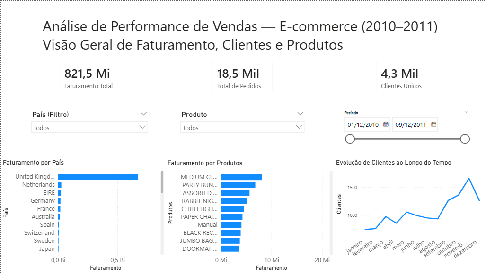

# Análise de Performance de Vendas — E-commerce

Este projeto tem como objetivo analisar dados transacionais de e-commerce utilizando Python, SQL e Power BI, com foco em geração de insights de negócio relacionados a faturamento, comportamento de clientes e desempenho de produtos.

## Visão Geral

A análise foi realizada a partir de um conjunto de dados de transações reais, contendo informações sobre pedidos, produtos, clientes e datas. O projeto contempla desde o tratamento dos dados até a construção de um dashboard interativo.

## Dados

Os dados utilizados neste projeto são públicos e estão disponíveis em:

https://archive.ics.uci.edu/ml/datasets/Online+Retail

Este dataset contém transações de um e-commerce do Reino Unido entre 2010 e 2011, incluindo informações de pedidos, produtos, clientes e localização. :contentReference[oaicite:1]{index=1}

Devido ao tamanho do arquivo, os dados não foram incluídos neste repositório.

## Ferramentas e Tecnologias

- Python (Pandas)
- SQL (SQLite)
- Power BI

## Estrutura do Projeto

- `notebooks/` — Limpeza e preparação dos dados em Python  
- `sql/` — Consultas analíticas em SQL  
- `powerbi/` — Dashboard desenvolvido no Power BI (.pbix)  
- `images/` — Imagem do dashboard  

## Dashboard

## Principais Insights

- O Reino Unido concentra a maior parte do faturamento total  
- Um grupo reduzido de produtos é responsável por grande parte das vendas  
- Há crescimento consistente na atividade de clientes ao longo do tempo  

## Como Executar

1. Abrir o notebook na pasta `notebooks/`  
2. Executar as etapas de tratamento de dados  
3. Utilizar as consultas SQL para análise  
4. Abrir o arquivo do Power BI para visualização do dashboard  
